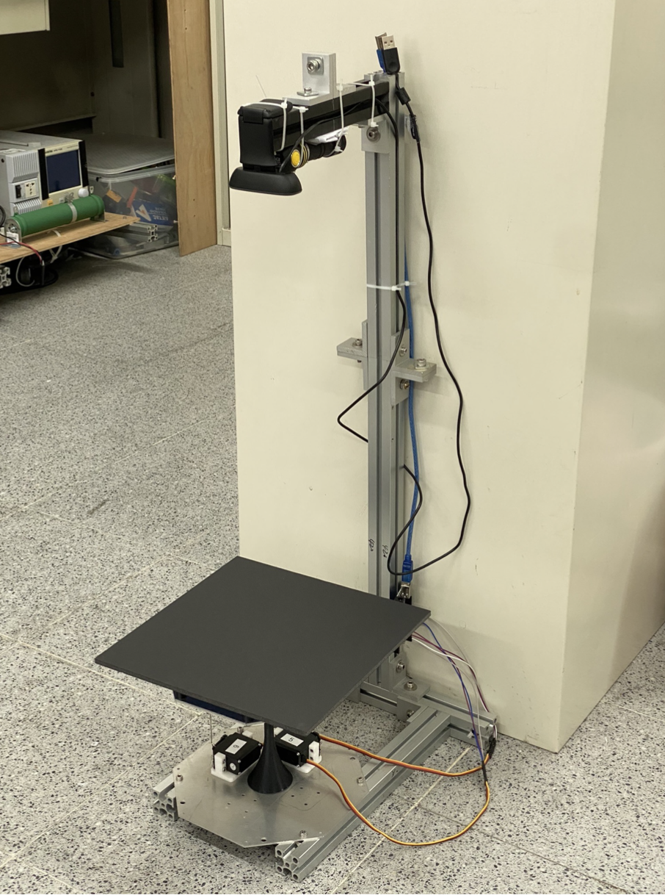
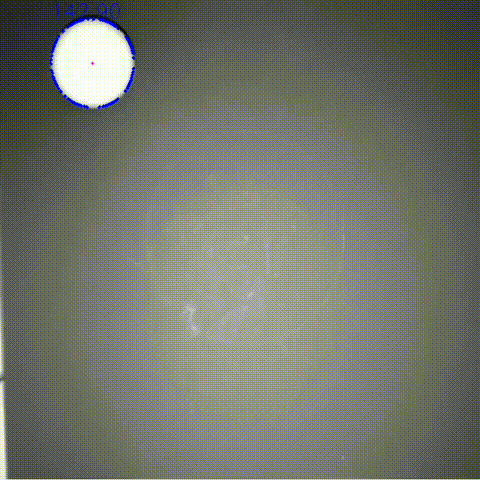
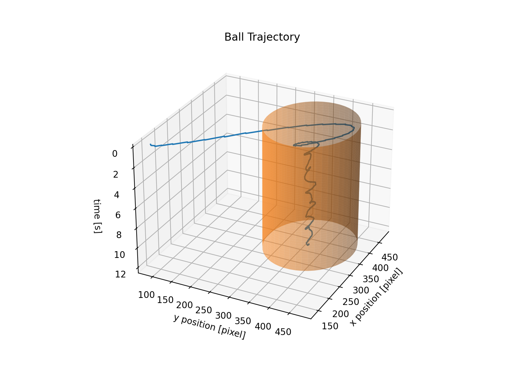
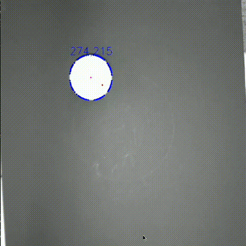
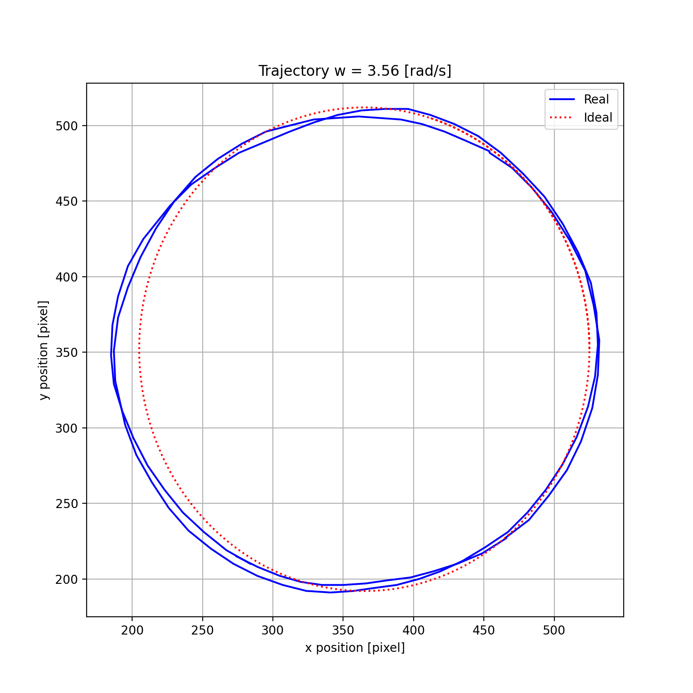

# Mechatronics Design and Practice course porject
### Teacher: S. K. Hung
This repo contains the final project code in the 2021 Mechatronics Design and Practice course.
We consturcted a balancing platform to complete different task, the device is shown in the folloing figure:

---

## Balance the ball
The first task is to balancing the ball into the center of the platform.

-Result

---

## Circling the ball
The second task is to make the ball moving on the specific circle.

-Result

---

## Catching the ball
The last task is to make the device catch the ball which is thrown by others.

-Result

---